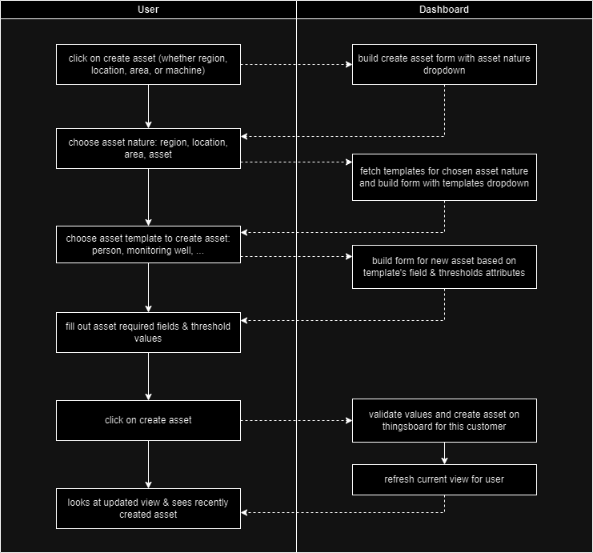
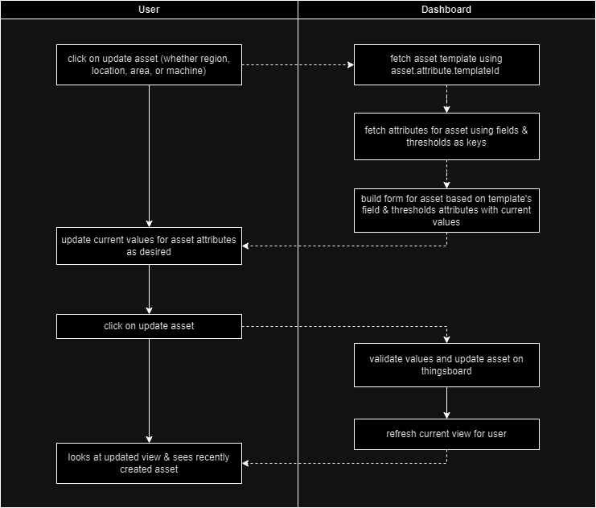

# Assets

*current version:* **1.0**

in iotlogiq, an asset represents an entity that has business value, whether because it is the main value item for the use case, or because it is a necessary part of the structure to build the use case.

-----

## 🧬 current types of assets

| type | description | 
| :- | :- |
| Region | it represents a geographical region with structural purposes for those clients that have assets in several countries and desire general and specific overviews; it is also valuable as to manage user & user groups scope for each customer |
| Location | it represents what is chosen to be a specific location that contains, or is related, to relevant assets; it is also valuable as to manage user & user groups scope for each customer. |
| Area | it represents a physical or logical space that allows to contain a specific set of assets, and to apply business logic for them, as is the case with tracking and geofences. |
| Machine | it represents the asset that is being monitorized; it has a specific relationship with devices `deviceToMachine` and it should build valuable business information out of the telemetry linked devices provide. |

-----

## 🔗 current relationship types

currently, asset types and devices relate in the following manner:

- `Company` 1---locationToCompany--->n `Location`
- `Location` 1---areaToLocation--->n `Area` 
- `Area` 1---machineToArea--->n `Machine` 
- `Machine` 1---deviceToMachine--->n `Device`

recently a region asset type was added for a specific use case, based on `Contains` relations; it was implemented as an isolated case and its addition had no impact on current production services.

- `Company` 1---contains--->n `Region`
- `Region` 1---contains--->n `Region`
- `Region` 1---contains--->n `Location`


> note: for version 2.0 relationships should be more flexible and based on generic Contains and Manage relationships; if automated, user/userGroups scope may be based on a new type of relation.

-----

## 🎯 what about specific asset types?

currently it is not possible to add necessary attributes that help characterize a specific asset for a specific use case, hence making it hard to add any value based on asset nature and business goals.

this is because we are using asset profiles (asset types) to specify the nature of our entities based on the structural point of view, instead of the business goal point of view, so when we edit them on main dashboard we don't know what properties to add besides name, label and an image.

in order for us to add value it is necessary to be able to characterize these assets in a specific manner, but we cannot do it by switching our asset profile approach for version 1.0, as it is most likely the whole solution will break and the code is not written in a debug-friendly environment, nor are there any automated unit tests for this regard.

so, the proposed way to do it as a patch to move forward to version 1.99 is to do it by creating asset templates that hold this information since the moment when the asset is created.

> note: once we arrive at version 1.99, it will make sense to redesign from scracth and loosen up the tightness of current relations and asset profile strategy.

-----

## 🏭 asset template proposal

the idea is to build assets that serve as template for future assets to be created; these asset templates will be created by senzary staff as part of an use case creation process.

every asset an user creates (or that we create for an user) will have a nature (what we have used for asset profiling: region, location, area, machine), and a `templateId` which references the assetTemplate it is based on.

these assets templates will hold a `fields` dictionary with information about each property that makes sense for this specific asset type from a business and functional perspective.

```js
// what the fields dictionary would look like for, let's say, a person
const fields = {
    identification: {
        type: "string",
        required: true,
        description: "alpahnumerical value uniquely identifying this person in the client's context.",
        editableAfterCreation: false
    },
    firstName: {
        type: "string",
        required: true,
        description: "this is the person's first name."
    },
    lastName: {
        type: "string",
        required: true,
        description: "this is the person's last name."
    },
    role: {
        type: "string",
        required: false,
        description: "this is the person's role or job description"
    },
    weight: {
        type: "numeric",
        required: false,
        description: "just as an example for the need of units on numeric fields.",
        units: {
            metric: "Kg",
            imperial: "lbs"
        }
    }
};
PersonTemplate.serverAttributes.fields = fields;
```

this `fields` attribute will be used for asset creation process by users (asset onboarding) and also whenever the user desired to update one of these values for the asset.

there shall also be `thresholds` attribute for this templates, as a dictionary that holds information about critical values for different purposes (though mainly alarm management).

```js
// this is what the thresholds attribute may look like, say for a monitoring well
const thresholds = {
    maxWTD: {
        type: "numeric",
        units: {
            metric: "m",
            imperial: "in",
        },
        description: "water table depth value that requires a critical alarm for low leves in monitoring well."
    },
    warningWTD: {
        type: "numeric",
        units: {
            metric: "m",
            imperial: "in"
        },
        description: "water table depth value that requires a warning when surpased."
    }
};
MonitoringWellTemplate.attributes.thresholds = thresholds;
```

`thresholds` are also editable for the user in a ver similar process as the one used to update `fields` properties; this will be better explained further ahead.

then there should also be a `kpis` dictionary with description for this asset specific business key process indicators.

```js
// for the same monitoring well the kpis dictionary may look like this
const kpis = {
    WTD: {
        name: "Water Table Depth",
        description: "it is the distance from surface level to water table; it grows as water level lowers and viceversa.",
        method: "it is calculated using the sensor's depth attribute, set on installation and updated by the client when manually recalibrating the sensor on site, and the level measurement from a submerged level sensor; formula is sensor's depth - sensor level reading, where sensor level reading is the distance from the submerged sensor to the water table.",
        observations: "when negative it is assumed that the monitoring well surface is flooded." 
    }
};
```

`kpis` attributes are to be used on asset rulechain to use sensors inputs in order to generate business value indicators for related assets.

-----

## 🔨 required updates to Main Dashboard

one of the goals of the asset template proposal is to allow users to create characterized assets from their Main Dashboard access.

currently we can only update name, label and image for assets of any type, so changes need to be implemented in every process where an asset is created or updated.



this is how the process would look like in terms of what the dashboard would need to do in order to adapt to this proposal. 

in order not to break current production operation, we must choose between:

    a) patch a duplicate of current Main Dashboard

or

    b) create a new custom widget to replace current entities tables 

the process might be simplified if asset creation is moved to one button and we have the user choose the nature (location, area, machine) and the template from on single form/widget.

updates must also be implemented on the update asset features:



-----

## 🗿 asset templates of different natures

in order to maintain consistency with the current asset profile strategy, there will be asset templates of these different natures (type): `region`, `location`, `area`, `machine`.

the following tables contain examples for asset templates per asset nature (type) for the current proposal for patch `v1.99`.

-----

### 🌎 regions

additional geographical abstraction for specific cases in which the client requires another layer to group locations by; regions contains locations; regions may also contain other regions.

regions are not required for smart industries customers, this is an optional additional abstraction layer.

| region templates (optional)  | fields | thresholds | kpis |
| :-: | :- | :- | :- |
| Country | perimeter, ... | ... | ... |
| State | perimeter, ... | ... | ... |
| County | perimeter, ... | ... | ... |
| Municipality | perimeter, ... | ... | ... |

> note: regions was an abstraction recently added specifically to support AES data centers structure for the navigation dashboard that shows countries (regions) that may have several locations (facilities) that may have several areas (floors, areas...) with the data rooms that are the main asset and take the spot of machines for that use case.

-----

### 🏦 locations

asset templates to represent locations as geographic objects (similar to regions) or specific buiilding types; locations are required for smart industries customers.

| location templates | fields | thresholds | kpis |
| :-: | :- | :- | :- |
| State | perimeter, ... | ... | ... |
| County | perimeter, ... | ... | ... |
| Office Building | numberOfFloors, latitude, longitude, writtenAddress, perimeter, frontalImage, ... | targetPowerConsumption, ... | powerConsumptionVsBaseline, ... |
| Power Plant | latitude, longitude, writtenAddress, perimeter, frontalImage, ... | minActiveGenerators, ... | unplannedDowntimePerPeriod, ... |
| Distribution Center | latitude, longitude, writtenAddress, perimeter, frontalImage, ... | maxInTransitUnitCount, ... | incomingUnitsPerPeriod, outGoingUnitsPerPeriod, meanUnitTransitTime, ... |

-----

### ⏹ areas

asset templates to represent a physical or virtual space inside locations so that they contain or relate to assets; areas are required for smart industries customers.

| area templates | fields | thresholds | kpis |
| :-: | :- | :- | :- | 
| Building Floor | floorNumber, totalArea, hasElevatorAccess, hasStairCaseAcces, isRoof, isBasement, ... | maxPeopleCount, ... | peopleCountPerPeriod, emptyVsNonEmptyPeriodRatio, ... |   
| Parking Lot | vehicleTypes, slotsPerVehicleType, pricePerHour (perVehicleType), ... | maxVehiclesPerType, maxStayPerVehicleType, ... | occupancyPerPeriod, incomePerPeriod, incomePerVehicleType, ... | 
| Map Geofence | perimeter, transitCostPerPeriod, ... | maxSpeedAllowed, maxVehicleCount, ... | vehicleCountPerPeriod, ... |

-----

### ⛽ machines

these are asset templates usually closer to the business as they determine specific kpi's based on telemetry from sensors assigned to them; machines are also required for smart industries customers.

| machine templates | fields | thresholds | kpis |
| :-: | :- | :- | :- | 
| Data Room | totalArea, numberOfServers, numberOfDoors, ... | targetPowerConsumption, maxTemperature, maxTimeOpenDoor ... | powerConsumptionVsBaseline, temperaturePeaksPerPeriod, ... |
| Manlift | model, range, enginePower, hoursOperativeSinceLastService, ... | maxSpeed, maxHoursWithoutService, ... | movingVsStaticRatio, meanMotionDurationPerPeriod, motionDurationPeaksPerPeriod, ... | 
| Person | firstName, lastName, role, identification, ... | ... | timeSpentOnAreaPerPeriod, movingVsStaticRatio, ... | 
| High Pressure Pump | model, enginePower, isoStandard, isoClass, ... | maxAnomalyRate, ... | hoursOperativeSinceLastService, hoursAnomalyVsNormalRatio, ... |
| Monitoring Well | sensorDepth, latitude, longitude, altitude, ... | warningWTD, maxWTD, ... | WTD, WTDPeaksPerPeriod, ... |
| Layout Zone | perimeterXY, bssIds, wifissIds, floorMapImage, isHazardous ... | maxPeopleCount, minPeopleCount (queues?), maxVehicleCount, minVehicleCount (load balancing?), ... | occupancyPerPeriod, emptyVsNotEmptyPeriodRatio, ... |

-----

## ⏭ next steps

- approve asset template patch for version `v1.99`
- create asset templates for aramark upcoming demo (office building/plant, building floors, electrical panels) as test case to implement updates to Main Dashboard
- test user is able to create characterized assets for power management customers
- plan & merge for this patch to production Main Dashbaord 
- plan & migrate use cases to use asset templates

-----

## 👀 changelog

| timestamp | author | changes |
| :-: | :- | :- |
| 2024-10-15T02:22:41.425Z | @ernestomedinam | creates repo & ASSET.md file. |
| 2024-10-15T16:49:16.228Z | @ernestomedinam | updates some styling on code bits. |
