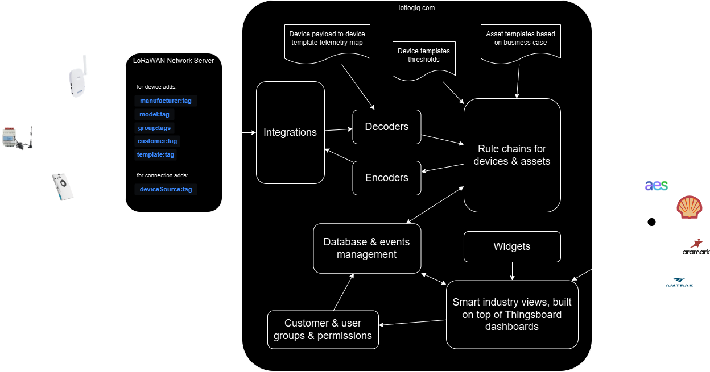

# Smart industry

Smart industry is a solution for companies to be able to manage assets and facilities based on best practices for different industries or areas of expertise.

this concept & its current implementation has been documented in several places:

- [Architecture IoTLogIQ smart industry as is v1.0](https://drive.google.com/file/d/1OvyuEJczvsJzxBztJSuJpRbrF3H0d_gM/view?usp=sharing)
- [IoTLogIQ smart industry instructions](https://senzary.atlassian.net/l/cp/dMjEoAUh)
- [IoTLogIQ smart industry on confluence product domain](https://senzary.atlassian.net/l/cp/iYPE4Wkf)
- [IoTLogIQ smart industry v2.0](https://drive.google.com/file/d/1QmFRCsAGPhVmw1LGdfM_wEUWTtbmxXYU/view?usp=sharing)

choice was to implement this concept on top of Thingsboard platform, in order to have a shorter time to market as this is an already built solution with white labeling capabilities so that third parties can build business logic layers using its built-in features.

here is a document with observations about Thingsboard friction regarding some of the features smart industry wants to provide its customers with: [Thingsboard observations 1.0 and 2.0 Link](https://senzary.atlassian.net/l/cp/dMjEoAUh)

as of October 2024, smart industry v1.0 is being used by clients; versioning has not being updated though some updates have been implemented, as well as some tests regarding v2.0 plans.

this content's purpose is to serve as complementary documentation focused on implementation detail in order to serve as a guide for a set of important changes that will be implemented on smart industry to take it to v1.99 so that:

1. identified bugs are resolved
2. features that we never completely implemented are correctly enabled
3. work in new features for v1 stops once on v1.99
4. the team is able to focus on v2.0 planning, design & development

-----

## 🔨 general implementation details

once you've checked documentation listed above, this diagram should make sense in terms of showing general flow of data through different domains and processes; our goal is to set up guidelines and rules that are to be enforced on these domains & processes so that features like building business value kpis for assets are possible.

guidelines set and agreed upon in these documentation will allow us to enforce a process in which we have to 

- `conceptualize and build the business` case based on our client's industry, ideally by the hand of the experts: our client's staff
- `catalog the asset templates` of any type required for this business case to work
- figure out `business value kpis` for these assets of all types you've designed
- `plan UI/UX` through mockups for what this business case would loook like for an user
- plan `customer & user onboarding strategy`
- `choose or validate devices chosen` based on how adequate they are for telemetry required to satisfy kpis
- `catalog the device templates` of any type not existing yet
- `map the devices' telemetry` to their expected normalized equivalent (the dictionary)
- run process for `customer, first users & assets onboarding`
- `plan & design integrations`, and build unit tests for data converters
- `create integrations and data converters` based on design
- prepare & run process to `provision devices into thingpark`
- prepare & run process to `onboard devices into iotlogiq`
- write code to `pass the tests for data converters` and upload them to iotlogiq
- `build & test the rule chain`, and check for any alarms regarding message integrity or possible duplicates
- `clean device & assets telemetry` from testing process & certify entities data flow is ok
- `complete & test downlinks are working` as well, worth repeating separately as data converters are usually reduced to decoding concepts and it's not the case, downlinks matter
- complete `work on UI/UX and test/adjust with customer user`
- process this business case under big data and data ecosystem perspective in order to `plan additional enrichment & business logic capacities` for this smart industry module

## 📚 table of contents

1. [Provisioning & onboarding processes](./PROVISIONING_AND_ONBOARDING.md)
2. [Asset templates proposal](./ASSETS.md)
3. [Device templates proposal](./DEVICES.md)
4. [Integrations](./INTEGRATIONS.md)
5. [Data converters](./DATA_CONVERTERS.md)
6. [Rule chains](./RULE_CHAINS.md)

-----

## 👀 changelog

| timestamp | author | changes |
| :-: | :- | :- |
| 2024-10-31T14:29:59.086Z | @ernestomedinam | creates README.md file |
