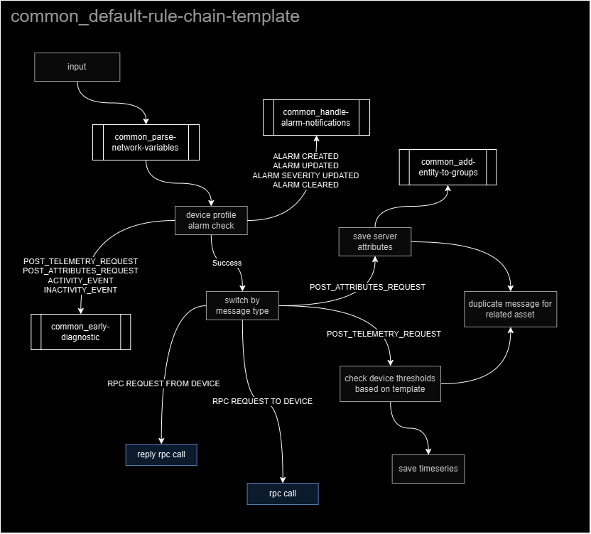

# Rule chains

rule chains are a chance to subscribe to events in order to do stuff when they happen; conceptually, we may think of them as event listeners that attach to an entity, whether devices or assets.

however, rule chains are more than just specific event listeners; they are also functions in its basic form, function that have an originator entity and a message object with `msg`, `metadata`, and a `msgType` properties.

the `msg` and `metadata` variables of this message object represent the payload that is being carried through the nodes of each rule chain; these nodes are provided by Thingsboard and serve as code snippets that one would use inside of a function.

these nodes also allow us to build conditional patterns, fetch attributes for the originator and related entities, manage alarms, and save telemetry and attributes amongst other things that include custom code.

-----

## 🧬 type of events for rule chains

| types | description |
| :- | :- |
| POST_TELEMETRY_REQUEST, POST_ATTRIBUTES_REQUEST, RPC_CALL_REQUEST, ... | Incoming telemetry, attribute update or RPC call from device |
| ATTRIBUTES_UPDATED, ENTITY_CREATED, ENTITY_UPDATED, ALARM_CLEARED, ALARM_UPDATED, ... | Entity life-cycle event: created, updated, deleted, assigned, unassigned, attributes updated |
| ACTIVITY_EVENT, INACTIVITY_EVENT, CONNECT_EVENT, DISCONNECT_EVENT, ... | Device status event: connected, disconnected, active, inactive, etc |

-----

## 🏭 rule chains and device profiles

each device profile has a default rule chain that will be listening to events for devices assigned to this profile; one device profile can only have a default rule chain, but one rule chain can serve many device profiles.

a rule chain for an asset must be focused on enriching data based on attributes that characterize the asset from a business logic perspective.

for a device, however, the rule chain must also verify message integrity (that telemetry and attributes have what they are expected to have), process & normalize network variables, have an early troubleshoot scan, and manage technical alarms.

with this in mind and the use of generic rule chains that help us separate concerns and reuse blocks of code, a standard template for every device rule chain would look like this:

----- 

## 📐 rule chain naming rules

in order to maintain consistency throughout the whole process, we have to set up naming rules for rule chains.

proposed rules are:

- it uses kebab-case syntax (no uppercase, hyphens or dashes instead of spaces, no underscores... [more](https://developer.mozilla.org/en-US/docs/Glossary/Kebab_case))
- it specifies device profile or template, as necessary, and closes with the word `rules`, e.g: `enery-sensor-rules`, `submergible-level-sensor-rules`

-----

## 📏 what are the rules to create a generic rule chain?

these are basic rules for readability & generic rule chain reuse:

- add detail to node descriptions and use descriptive names for them when you create them or update them
- generic rule chains should be able to always return the same originator with the same incoming message on `Sucess` output, or its equivalent if it is a custom one
- generic rule chains should return `Failure` on error; they should also create alarms if necessary
- generic rule chain naming syntax is to be `common_<name-for-rule-chain>`; the name should be descriptive and kebab-case formatted 

-----

## ⏳ when should a rule chain be created?

a rule chain must be focused on business perspective, specially if it is an asset rule chain; this means that before creating a rule chain we have to know the context for these devices and assets, its industry and its business.

in order to create and start a rule chain we'd need to have:

- completed steps to create and start work on integrations 
- completed steps and started work on data converters
- the involved devices & assets rule chains have been planned, meaning they have been designed on a diagram at a similar level as the one shown for the default rule chain template

keep in mind that because rule chains are only to be worked on using Thingsboard interface, then we HAVE to be very mindful about updating description for any node that we work on. 

this mean, any time we create/update a node, we HAVE to check that the description is still valid and valuable (it says something more than the node's name 😐).

-----

## 👀 changelog

| timestamp | author | changes |
| :-: | :- | :- |
| 2024-10-28T23:45:53.153Z | @ernestomedinam | creates RULE_CHAINS.md file |
